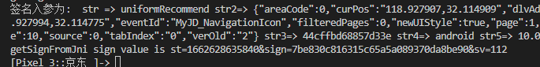
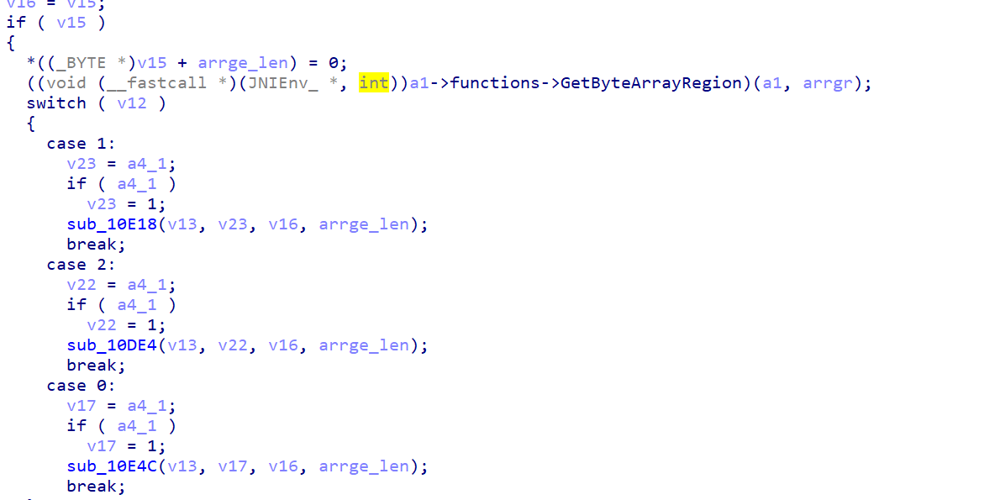
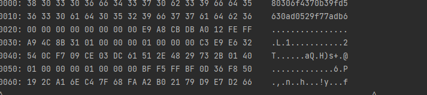
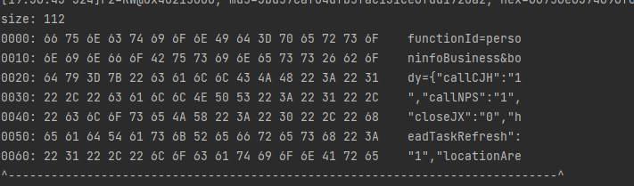
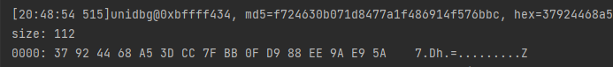
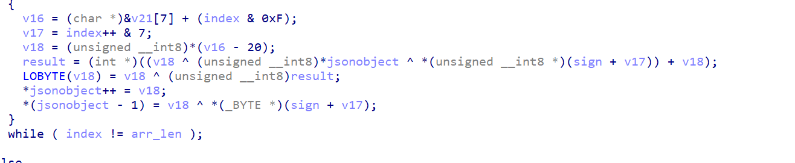

主要是根据

https://bbs.pediy.com/thread-266377.htm

https://bbs.pediy.com/thread-272100.htm

这两个文章来分析jd的sign

先抓包获得sign,

unidbg模拟执行 分析version2

unicorn 模拟执行 分析 version 1


### 京东sign 分析
来源于java的getsignfromjni,先frida hook获取参数

之后unidbg模拟执行调用
```
public class JD extends AbstractJni {


    private static final String SO_PATH = "C:/Users/24657/Desktop/proj1/jd/libjdbitmapkit.so";
    private static final String APK_PATH = "C:/Users/24657/Desktop/proj1/jd/jd.apk";

    private static final String INSTALL_ID = "55a9c688729bb118";
    private static final String PLAT_FROM = "android";
    private static final String VERSION = "10.4.6";
    private AndroidEmulator androidEmulator;

    public static void main(String[] args) {
        Logger.getLogger("com.github.unidbg.AbstractEmulator").setLevel(Level.DEBUG);
        Logger.getLogger("com.github.unidbg.linux.android.dvm.DalvikVM").setLevel(Level.DEBUG);
        Logger.getLogger("com.github.unidbg.linux.android.dvm.BaseVM").setLevel(Level.DEBUG);
        Logger.getLogger("com.github.unidbg.linux.android.dvm").setLevel(Level.DEBUG);
        JD jd = new JD();
        jd.start();
    }


    public void start() {
        androidEmulator = AndroidEmulatorBuilder.for32Bit().setProcessName("com.jingdong.android")
                .build();
        Debugger debugger = androidEmulator.attach();

        Memory androidEmulatorMemory = androidEmulator.getMemory();
        androidEmulatorMemory.setLibraryResolver(new AndroidResolver(23));
        VM dalvikVM = androidEmulator.createDalvikVM(new File(APK_PATH));
        DalvikModule module = dalvikVM.loadLibrary(new File(SO_PATH), false);
        dalvikVM.setJni(this);
        Module moduleModule = module.getModule();
        dalvikVM.callJNI_OnLoad(androidEmulator, moduleModule);
        debugger.addBreakPoint(moduleModule, 0x126ac);
        List<Object> params = new ArrayList<>();
        params.add(dalvikVM.getJNIEnv());
        params.add(0);
        DvmClass context = dalvikVM.resolveClass("android/content/Context");
        params.add(dalvikVM.addLocalObject(context.newObject(null)));
        params.add(dalvikVM.addLocalObject(new StringObject(dalvikVM, "personinfoBusiness")));
        params.add(dalvikVM.addLocalObject(new StringObject(dalvikVM, "{\"callCJH\":\"1\",\"callNPS\":\"1\",\"closeJX\":\"0\",\"headTaskRefresh\":\"1\",\"locationArea\":\"0_0_0_0\",\"menuStaticSource\":\"0\",\"menuTimeStamp\":\"1631586010000\"}")));
        params.add(dalvikVM.addLocalObject(new StringObject(dalvikVM, INSTALL_ID)));
        params.add(dalvikVM.addLocalObject(new StringObject(dalvikVM, PLAT_FROM)));
        params.add(dalvikVM.addLocalObject(new StringObject(dalvikVM, VERSION)));
        Number numbers = moduleModule.callFunction(androidEmulator, 0x028B4 + 1, params.toArray());
        DvmObject<?> object = dalvikVM.getObject(numbers.intValue());
        System.out.println("加密结果为:" + object.getValue());
    }

    @Override
    public DvmObject<?> getStaticObjectField(BaseVM vm, DvmClass dvmClass, String signature) {
        if ("com/jingdong/common/utils/BitmapkitUtils->a:Landroid/app/Application;".equals(signature)) {
            //返回appliation
            return vm.resolveClass("android/app/Activity",
                    vm.resolveClass("android/content/ContextWrapper",
                            vm.resolveClass("android/content/Context"))).newObject(null);
        }
        return super.getStaticObjectField(vm, dvmClass, signature);
    }

    @Override
    public DvmObject<?> callStaticObjectMethod(BaseVM vm, DvmClass dvmClass, String signature, VarArg varArg) {
        if ("com/jingdong/common/utils/BitmapkitZip->unZip(Ljava/lang/String;Ljava/lang/String;Ljava/lang/String;)[B".equals(signature)) {
            byte[] unzip = vm.unzip("META-INF/JINGDONG.RSA");
            System.out.println("unzip " + new String(unzip));
            return new ByteArray(vm, unzip);
        } else if ("com/jingdong/common/utils/BitmapkitZip->objectToBytes(Ljava/lang/Object;)[B".equals(signature)) {
            DvmObject<?> objectArg = varArg.getObjectArg(0);
            byte[] bytes = objectToBytes(objectArg.getValue());
            return new ByteArray(vm, bytes);
        }
        return super.callStaticObjectMethod(vm, dvmClass, signature, varArg);
    }

    public static byte[] objectToBytes(Object obj) {
        try {
            ByteArrayOutputStream byteArrayOutputStream = new ByteArrayOutputStream();
            ObjectOutputStream objectOutputStream = new ObjectOutputStream(byteArrayOutputStream);
            objectOutputStream.writeObject(obj);
            objectOutputStream.flush();
            byte[] byteArray = byteArrayOutputStream.toByteArray();
            objectOutputStream.close();
            byteArrayOutputStream.close();
            return byteArray;
        } catch (IOException e) {
            return null;
        }
    }

    @Override
    public DvmObject<?> newObject(BaseVM vm, DvmClass dvmClass, String signature, VarArg varArg) {
        if ("sun/security/pkcs/PKCS7-><init>([B)V".equals(signature)) {
            ByteArray byteArray = varArg.getObjectArg(0);
            try {
                PKCS7 pkcs7 = new PKCS7(byteArray.getValue());
                return vm.resolveClass("sun/security/pkcs/PKCS7").newObject(pkcs7);
            } catch (ParsingException e) {
                e.printStackTrace();
            }

        }
        return super.newObject(vm, dvmClass, signature, varArg);
    }

    @Override
    public DvmObject<?> callObjectMethod(BaseVM vm, DvmObject<?> dvmObject, String signature, VarArg varArg) {
        if ("sun/security/pkcs/PKCS7->getCertificates()[Ljava/security/cert/X509Certificate;".equals(signature)) {
            PKCS7 pkcs7 = (PKCS7) dvmObject.getValue();
            X509Certificate[] certificates = pkcs7.getCertificates();
            DvmObject<?> object = ProxyDvmObject.createObject(vm, certificates);
            return object;


        }
        return super.callObjectMethod(vm, dvmObject, signature, varArg);
    }

    @Override
    public DvmObject<?> getObjectField(BaseVM vm, DvmObject<?> dvmObject, String signature) {
        //sourceDir 代表当前apk目录
        if ("android/content/pm/ApplicationInfo->sourceDir:Ljava/lang/String;".equals(signature)) {
            StringObject stringObject = new StringObject(vm, APK_PATH);
            return stringObject;
        }
        return super.getObjectField(vm, dvmObject, signature);
    }


    @Override
    public DvmObject<?> callObjectMethodV(BaseVM vm, DvmObject<?> dvmObject, String signature, VaList vaList) {
        if ("java/lang/StringBuffer->append(Ljava/lang/String;)Ljava/lang/StringBuffer;".equals(signature)) {
            StringBuffer stringBuffer = (StringBuffer) dvmObject.getValue();
            DvmObject<?> objectArg = vaList.getObjectArg(0);
            stringBuffer.append(objectArg.getValue().toString());
            return vm.resolveClass("java/lang/StringBuffer").newObject(stringBuffer);
        } else if ("java/lang/Integer->toString()Ljava/lang/String;".equals(signature)) {
            Integer integer = (Integer) dvmObject.getValue();
            return new StringObject(vm, integer.toString());
        }else if("java/lang/StringBuffer->toString()Ljava/lang/String;".equals(signature)){
            StringBuffer stringBuffer = (StringBuffer) dvmObject.getValue();
            return new StringObject(vm, stringBuffer.toString());
        }
        return super.callObjectMethodV(vm, dvmObject, signature, vaList);
    }

    @Override
    public DvmObject<?> newObjectV(BaseVM vm, DvmClass dvmClass, String signature, VaList vaList) {
        if ("java/lang/StringBuffer-><init>()V".equals(signature)) {
            StringBuffer stringBuffer = new StringBuffer();
            return vm.resolveClass("java/lang/StringBuffer").newObject(stringBuffer);
        } else if ("java/lang/Integer-><init>(I)V".equals(signature)) {
            int intArg = vaList.getIntArg(0);
            Integer integer = Integer.valueOf(intArg);
            return vm.resolveClass("java/lang/Integer").newObject(integer);
        }
        return super.newObjectV(vm, dvmClass, signature, vaList);
    }
}
```
st是时间戳

接着看sign的生成
sub_126ac
根据random_46 % 3随机在3个模式中选一个
看了模式2
进入模式2的函数
r0为

r1 为1
r2为 我的那个json参数的拼接字符串

r3 0x106长度

经过查看，前面是固定生成

unidbg调试得到结果


后面就只是xor了


