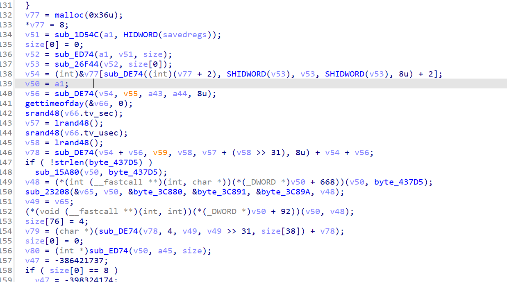
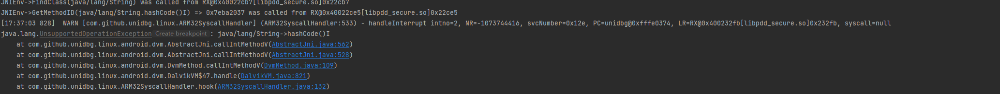

# pdd anti-token分析
version : 7.6.0
抓包发现发送请求有anti-token 而且每次都不一样


接着就去分析anti-token
jadx-gui 搜索anti-token ,最终发现主要是这个函数

frida参数查看，静态分析可得主要走j这个函数

```js
    let a = Java.use("com.aimi.android.common.http.a");
a.c.implementation = function(str, z){
    console.log('c is called' + "  " +str + "   " + z);
    let ret = this.c(str, z);
    var Map = Java.use("java.util.HashMap");
    var args_x = Java.cast(ret, Map);
    console.log('c ret value is ' + args_x);
   // showStacks3("com.aimi.android.common.http.a.c")
   
    return ret;
};

a.j.implementation = function(str){
    console.log('j is called');
    console.log("j arg " + str)
    let ret = this.j(str);
    var Map = Java.use("java.util.HashMap");
    var args_x = Java.cast(ret, Map);
    console.log('j ret value is ' + args_x);
    return ret;
};
```
通过分析，主要是f这个函数，而f那个函数还是个接口，frida hook d.a() json.stringify打印一下返回值是哪个类

```js
let d = Java.use("com.aimi.android.common.service.d");
d.a.implementation = function(){
    console.log('a is called');
    let ret = this.a();
    console.log('a ret value is ' + JSON.stringify(ret));         
    return ret;
};
```
最终是 com.xunmeng.pinduoduo.secure.s这个类


str frida hook 是 一个固定的字符串，看来是时间和这个固定字符串结合生成对应算法的

实际生成继续深入deviceinfo3,发现到so层了

so层deviceinfo3函数，加了控制流平坦化，不过粗看cfg图，基本可以确定是标准的平坦化，
真实块全部都完成switch的置换后，之后直接跳向主分发器了，只能说还只是标准ollvm
可以用obpo也可以用angr模拟执行

不过在这里，还是使用unidbg模拟执行查看

按照模板编写好相应后，遇到一些补环境问题，在此依依记录一下

callstaticmethoid出问题
```java
    @Override
    public void callStaticVoidMethodV(BaseVM vm, DvmClass dvmClass, String signature, VaList vaList) {
        if(signature.equals("com/tencent/mars/xlog/PLog->i(Ljava/lang/String;Ljava/lang/String;)V")){
            return;
        }
        super.callStaticVoidMethodV(vm, dvmClass, signature, vaList);
    }
```
之后又碰到这个问题

gcd frida hook一下

unidbg补环境
```java
    @Override
    public DvmObject<?> callStaticObjectMethodV(BaseVM vm, DvmClass dvmClass, String signature, VaList vaList) {
        if("com/xunmeng/pinduoduo/secure/EU->gad()Ljava/lang/String;".equals(signature)){
            return  new StringObject(vm,"03ae040aea5c7f3d");
        }
        return super.callStaticObjectMethodV(vm, dvmClass, signature, vaList);
    }
```
又报了这个错

unidbg补环境
```java
    @Override
    public DvmObject<?> callObjectMethodV(BaseVM vm, DvmObject<?> dvmObject, String signature, VaList vaList) {
        if("java/lang/String->replaceAll(Ljava/lang/String;Ljava/lang/String;)Ljava/lang/String;".equals(signature)){
            String obj = dvmObject.getValue().toString();
            String arg0 = vaList.getObjectArg(0).toString();
            String arg1 = vaList.getObjectArg(1).toString();
            String replaceAll = obj.replaceAll(arg0, arg1);
            return new StringObject(vm, replaceAll);
        }
        return super.callObjectMethodV(vm, dvmObject, signature, vaList);
    }
```

```java
   @Override
    public int callIntMethodV(BaseVM vm, DvmObject<?> dvmObject, String signature, VaList vaList) {
        if("java/lang/String->hashCode()I".equals(signature)){
            return dvmObject.getValue().toString().hashCode();
        }
        return super.callIntMethodV(vm, dvmObject, signature, vaList);
    }
```

增加ioresolver 
```java
   @Override
    public FileResult resolve(Emulator emulator, String pathname, int oflags) {
        System.out.println("path: " + pathname);
        return null;
    }
```

主要访问了这几个文件，以及

文件访问处理好了，接下来是_system_property_get这个函数的处理，该函数在libc里，实现比较复杂，但使用上又很频繁，因此Unidbg 在src/main/java/com/github/unidbg/linux/android 目录下有相 关类对它进行了Hook和封装，我们可以直接拿来用
```java
SystemPropertyHook systemPropertyHook=new SystemPropertyHook(emulator);
systemPropertyHook.setPropertyProvider(new SystemPropertyProvider() {
    @Override
    public String getProperty(String key) {
        System.out.println("ruibiaos key"+key);
        switch (key){

        }
        return null;
    }
});
memory.addHookListener(systemPropertyHook);
```

拿了这些系统输出
这几个获取原来是null,不用管
property主要是用unidbg自带的
```java
   SystemPropertyHook systemPropertyHook=new SystemPropertyHook(androidEmulator);
        systemPropertyHook.setPropertyProvider(new SystemPropertyProvider() {
            @Override
            public String getProperty(String key) {
                System.out.println("getProperty: "+key);
                switch (key){

                }
                return null;
            }
        });
```

popen hook 看看用了什么命令
```java
        Module moduleModule = module.getModule();
        int popenAddress=(int)moduleModule.findSymbolByName("popen").getAddress();
// 函数原型:FILE *popen(const char *command, const char *type);
        androidEmulator.attach().addBreakPoint(popenAddress, new BreakPointCallback() {
            @Override
            public boolean onHit(Emulator<?> emulator, long address) {
                RegisterContext registerContext=emulator.getContext();
                String command=registerContext.getPointerArg(0).getString(0);
                System.out.println(" popen command："+command);
                return true;
            }
        });

```


syscall popen用syscallhandle来处理
```java
package com.pdd;

import com.github.unidbg.Emulator;
import com.github.unidbg.arm.context.EditableArm32RegisterContext;
import com.github.unidbg.linux.ARM32SyscallHandler;
import com.github.unidbg.linux.file.ByteArrayFileIO;
import com.github.unidbg.linux.file.DumpFileIO;
import com.github.unidbg.memory.SvcMemory;
import com.sun.jna.Pointer;

import java.util.concurrent.ThreadLocalRandom;

public class pddSyscallHandler extends ARM32SyscallHandler {


    public pddSyscallHandler(SvcMemory svcMemory) {
        super(svcMemory);
    }

    @Override
    protected boolean handleUnknownSyscall(Emulator emulator, int NR) {
        switch (NR) {


            case 190:
                vfork(emulator);
                return true;


            case 114:
                wait4(emulator);
                return true;

            case 359:
                pipe2(emulator);
                return true;


        }
        return super.handleUnknownSyscall(emulator, NR);
    }


    private void vfork(Emulator<?> emulator) {
        EditableArm32RegisterContext context = (EditableArm32RegisterContext)


                emulator.getContext();
        int childPid = emulator.getPid() +
                ThreadLocalRandom.current().nextInt(256);
        int r0 = childPid;


        System.out.println("vfork pid=" + r0);


        context.setR0(r0);
    }


    private void wait4(Emulator emulator) {
        EditableArm32RegisterContext context = (EditableArm32RegisterContext)


                emulator.getContext();
        int pid = context.getR0Int();


        Pointer wstatus = context.getR1Pointer();
        int options = context.getR2Int();
        Pointer rusage = context.getR3Pointer();
        System.out.println("wait4 pid=" + pid + ", wstatus=" + wstatus + ", options=0x" + Integer.toHexString(options) + ", rusage=" + rusage);
    }

    protected int pipe2(Emulator<?> emulator) {
        EditableArm32RegisterContext context = (EditableArm32RegisterContext)emulator.getContext();
        Pointer pipefd = context.getPointerArg(0);
        int flags = context.getIntArg(1);
        int write = getMinFd();
        this.fdMap.put(write, new DumpFileIO(write));
        int read = getMinFd();
        String stdout = "10e113ec-fe94-4931-bcc5-e4c895322906\n";
        this.fdMap.put(read, new ByteArrayFileIO(0, "pipe2_read_side", stdout.getBytes()));
        pipefd.setInt(0, read);
        pipefd.setInt(4, write);
        System.out.println("pipe2 pipefd=" + pipefd + ", flags=0x" + flags + ", read=" + read + ", write=" + write + ", stdout=" + stdout);
        context.setR0(0);
        return 0;
    }


}

```

unidbg 完整代码
```java
package com.pdd;

import com.github.unidbg.AndroidEmulator;
import com.github.unidbg.Emulator;
import com.github.unidbg.Module;
import com.github.unidbg.arm.backend.DynarmicFactory;
import com.github.unidbg.arm.context.RegisterContext;
import com.github.unidbg.debugger.BreakPointCallback;
import com.github.unidbg.file.FileResult;
import com.github.unidbg.file.IOResolver;
import com.github.unidbg.file.linux.AndroidFileIO;
import com.github.unidbg.linux.android.*;
import com.github.unidbg.linux.android.dvm.*;
import com.github.unidbg.memory.Memory;
import com.github.unidbg.memory.SvcMemory;
import com.github.unidbg.unix.UnixSyscallHandler;

import java.io.File;
import java.util.ArrayList;
import java.util.List;

public class pdd extends AbstractJni implements IOResolver {

    private AndroidEmulator androidEmulator;
    private static final String SO_PATH = "C:/Users/24657/Desktop/unidbg_train/pdd/libpdd_secure.so";
    private static final String APK_PATH = "C:/Users/24657/Desktop/unidbg_train/pdd/pdd.apk";
    private static final String VERSION = "6.7.0";
    private VM dalvikVM;

    public static void main(String[] args) {
        pdd main = new pdd();
        main.create();
    }

    private void create(){
        //templeate
        AndroidEmulatorBuilder builder=new AndroidEmulatorBuilder(false){
            @Override
            public AndroidEmulator build() {
                return new AndroidARMEmulator(processName,rootDir,backendFactories) {
                    @Override
                    protected UnixSyscallHandler<AndroidFileIO> createSyscallHandler(SvcMemory svcMemory) {
                        return new pddSyscallHandler(svcMemory);
                    }
                };
            }
        };
        androidEmulator = builder
                .build();
        Memory memory = androidEmulator.getMemory();
        memory.setLibraryResolver(new AndroidResolver(23));

        // hook 系统调用获取资源
        SystemPropertyHook systemPropertyHook=new SystemPropertyHook(androidEmulator);
        systemPropertyHook.setPropertyProvider(new SystemPropertyProvider() {
            @Override
            public String getProperty(String key) {
                System.out.println("getProperty: "+key);
                switch (key){

                }
                return null;
            }
        });
        memory.addHookListener(systemPropertyHook);


        dalvikVM = androidEmulator.createDalvikVM(new File(APK_PATH));
        androidEmulator.getSyscallHandler().addIOResolver(this);
        DalvikModule module = dalvikVM.loadLibrary(new File(SO_PATH), false);

        Module moduleModule = module.getModule();
        int popenAddress=(int)moduleModule.findSymbolByName("popen").getAddress();
// 函数原型:FILE *popen(const char *command, const char *type);
        androidEmulator.attach().addBreakPoint(popenAddress, new BreakPointCallback() {
            @Override
            public boolean onHit(Emulator<?> emulator, long address) {
                RegisterContext registerContext=emulator.getContext();
                String command=registerContext.getPointerArg(0).getString(0);
                System.out.println(" popen command："+command);
                return true;
            }
        });

        dalvikVM.setJni(this);
        dalvikVM.setVerbose(true);
        dalvikVM.callJNI_OnLoad(androidEmulator, module.getModule());


        //准备deviceinfo3的参数
        List<Object> argList = new ArrayList<>();
        argList.add(dalvikVM.getJNIEnv());
        argList.add(0);
        DvmObject<?> context = dalvikVM.resolveClass("android/content/Context").newObject(null);
        argList.add(dalvikVM.addLocalObject(context));
        argList.add(dalvikVM.addLocalObject(new StringObject(dalvikVM, "/api/pmm/defined")));
        argList.add(dalvikVM.addLocalObject(new StringObject(dalvikVM,"Po2Ci20F")));


        //调用deice_info3
        Number number =  moduleModule.callFunction(androidEmulator, 0xb6f9, argList.toArray());
        String toString = dalvikVM.getObject(number.intValue()).getValue().toString();
        System.out.println(toString);


    }

    @Override
    public void callStaticVoidMethodV(BaseVM vm, DvmClass dvmClass, String signature, VaList vaList) {
        if(signature.equals("com/tencent/mars/xlog/PLog->i(Ljava/lang/String;Ljava/lang/String;)V")){
            return;
        }
        super.callStaticVoidMethodV(vm, dvmClass, signature, vaList);
    }

    @Override
    public DvmObject<?> callStaticObjectMethodV(BaseVM vm, DvmClass dvmClass, String signature, VaList vaList) {
        if("com/xunmeng/pinduoduo/secure/EU->gad()Ljava/lang/String;".equals(signature)){
            return  new StringObject(vm,"03ae040aea5c7f3d");
        }
        return super.callStaticObjectMethodV(vm, dvmClass, signature, vaList);
    }

    @Override
    public DvmObject<?> callObjectMethodV(BaseVM vm, DvmObject<?> dvmObject, String signature, VaList vaList) {
        if("java/lang/String->replaceAll(Ljava/lang/String;Ljava/lang/String;)Ljava/lang/String;".equals(signature)){
            String obj = dvmObject.getValue().toString();
            String arg0 = vaList.getObjectArg(0).toString();
            String arg1 = vaList.getObjectArg(1).toString();
            String replaceAll = obj.replaceAll(arg0, arg1);
            return new StringObject(vm, replaceAll);
        }
        return super.callObjectMethodV(vm, dvmObject, signature, vaList);
    }

    @Override
    public int callIntMethodV(BaseVM vm, DvmObject<?> dvmObject, String signature, VaList vaList) {
        if("java/lang/String->hashCode()I".equals(signature)){
            return dvmObject.getValue().toString().hashCode();
        }
        return super.callIntMethodV(vm, dvmObject, signature, vaList);
    }

    @Override
    public FileResult resolve(Emulator emulator, String pathname, int oflags) {
        System.out.println("path: " + pathname);
        return null;
    }
}
```

总结 ： 学会了unidbg 对system property 和 syscall popen的补环境