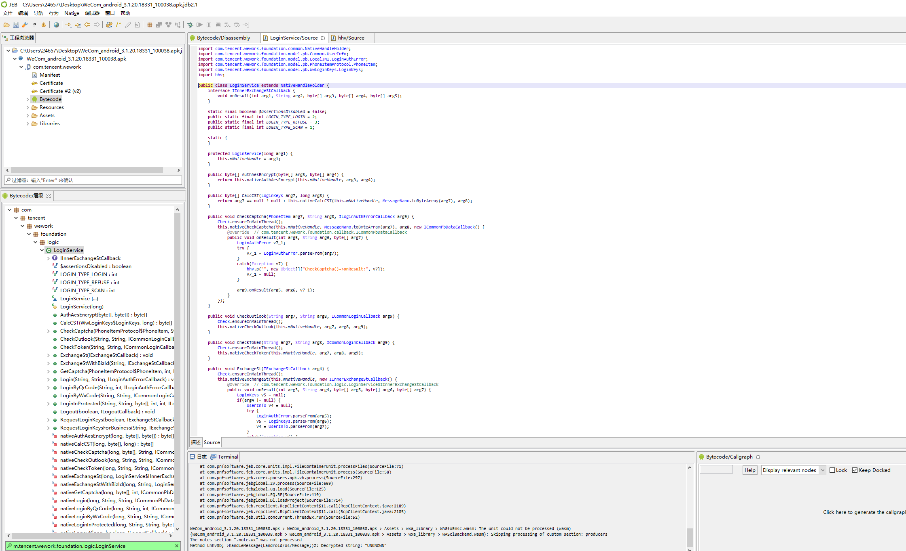
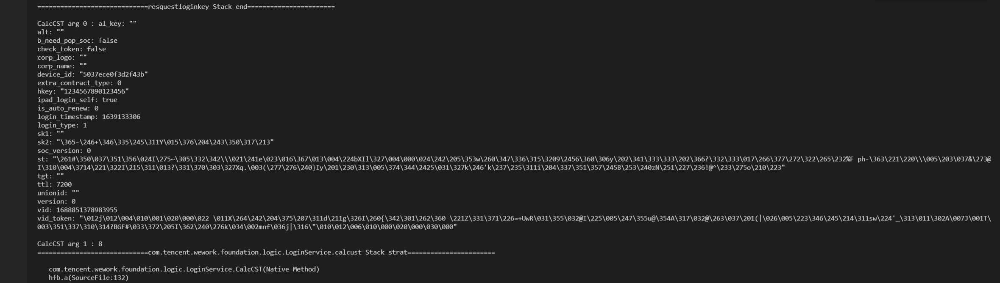
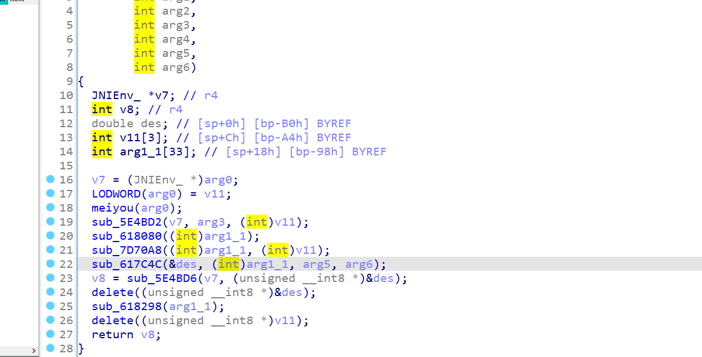
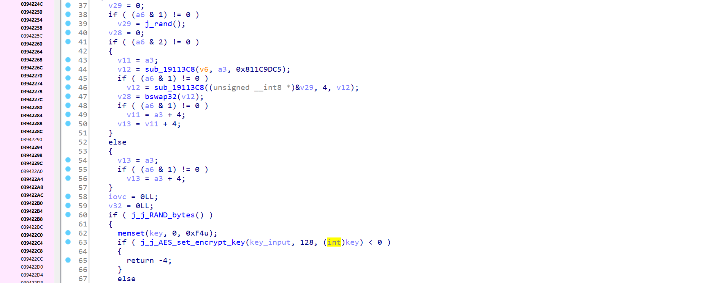
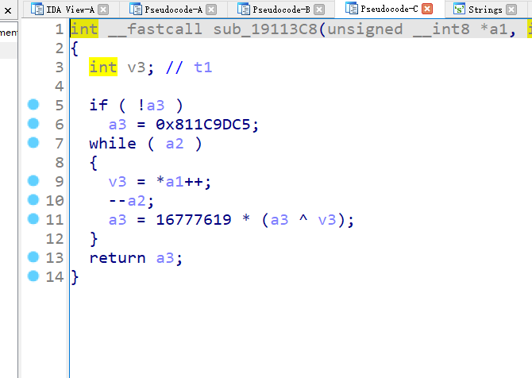

## 企业微信cst逆向

主要是学校每天都要健康打卡，太烦了，就想把它网址逆出来，但是网址主要是cst会随机生成，因此想了解一下cst生成的过程，先在java层找到cst生成的函数



用frida hook看一下参数 和栈回溯



之后再去c层进行查看



经过一段时间静态分析，发现是aes加密



不断的经过frida hexdump，弄清楚了加密过程 aes -cbc加密  最终的cst是前16位生成生成的iv 后面是aes加密后生成的结果

iv是random后



aes cbc加密 key是sk2 明文vid_token ，当然在c里面都是数组的形式，至于怎么分辨的主要是看java层操作protobuf 序列化了，所以逆序列化就可以了

sk2的属实没找到，后面抓包发现是登入时客户端给的，所以只能先放弃写企业wx脚本的希望了，用到的frida脚本

```javascript
function showStacks3(str_tag) 
{
   var Exception=  Java.use("java.lang.Exception");
   var ins = Exception.$new("Exception");
   var straces = ins.getStackTrace();

   if (undefined == straces || null  == straces) 
   {
       return;
   }

   console.log("=============================" + str_tag + " Stack strat=======================");
   console.log("");

   for (var i = 0; i < straces.length; i++)
   {
       var str = "   " + straces[i].toString();
       console.log(str);
   }

   console.log("");
   console.log("=============================" + str_tag + " Stack end=======================\r\n");
   Exception.$dispose();
};
function arrayBufferToBase64( buffer ) {

    var binary = '';
    
    var bytes = new Uint8Array( buffer );
    
    var len = bytes.byteLength;
    
    for (var i = 0; i < len; i++) {
    
    binary += String.fromCharCode( bytes[ i ] );
    
    }
    
    return window.btoa(binary);
    
    }


function Bytes2Str(arrBytes){
    var str = "";
    for (var i = 0; i < arrBytes.length; i++) {
        var tmp;
        var num = arrBytes[i];
        if (num < 0) {
            //此处填坑，当byte因为符合位导致数值为负时候，需要对数据进行处理
            tmp = (255 + num + 1).toString(16);
        } else {
            tmp = num.toString(16);
        }
        if (tmp.length == 1) {
            tmp = "0" + tmp;
        }
        if(i>0){
            str += ":"+tmp;
        }else{
            str += tmp;
        }
    }
    return str;
}

/*
setImmediate(function() {
    Interceptor.attach(Module.findExportByName("libwework_framework.so","Java_com_tencent_wework_foundation_logic_LoginService_nativeCalcCST"),{
        onEnter:function(args){
            console.log("so   arg0:" + args[0])
            console.log("so   arg1:" + args[1])
            //console.log(hexdump(args[1]))
            console.log("so   arg2:" + args[2])
            console.log("so   arg3:" + args[3])
            console.log("so   arg4:" + args[4])
            //console.log(hexdump(args[4]))
            console.log("so   arg5:" + args[5])
           // console.log(hexdump(args[5].readPointer()))
            //console.log(hexdump(args[5].add(4).readPointer()))
            //console.log(hexdump(args[5]))
            console.log("so   arg6:" + args[6])
        },
        onLeave:function(retval){
            console.log("so ret: " + retval);
        }
    })
    });

*/
// Java.perform(function (){
// console.log("")
// var clazz = Java.use("hfb");
// clazz.a.overload('java.lang.Long', 'com.tencent.wework.foundation.callback.ICommonStringCallback', 'int', 'java.lang.String', 'com.tencent.wework.foundation.model.pb.LocalJNI$LoginAuthError', 'com.tencent.wework.foundation.model.pb.WwLoginKeys$LoginKeys', 'com.tencent.wework.foundation.model.pb.Common$UserInfo').implementation = function(){
//     showStacks3("defpackage.hfb.a")
//     for(var j = 0 ; j < arguments.length ; ++j){
      
//         console.log("defpackage.hfb funqction arg" + j + ": " + arguments[j]) }
    
//     return this.a.apply(this,arguments)
// }
// })


// Java.perform(function(){
//     var cls = Java.use("com.tencent.wework.foundation.model.pb.WwLoginKeys$LoginKeys")
//     var JavaString = Java.use("java.lang.String");
//     cls.parseFrom.overload('[B').implementation = function(){
//         showStacks3("parseFrom")
//         console.log("parseFrom arg:" + JavaString.$new(arguments[0]))
//         var ret = this.parseFrom.apply(this,arguments)
//         console.log("parseFrom ret:" + ret)
//         return ret;
//     }
// })

// Java.perform(function(){
//     var clz = Java.use("com.tencent.wework.foundation.logic.LoginService$7")
//     var JavaString = Java.use("java.lang.String");
//     clz.onResult.implementation = function(){
//            console.log("resquestloginkey arg4:" + JavaString.$new(arguments[3]))
//            showStacks3("resquestloginkey")
//            return this.onResult.apply(this,arguments)
//     }
// })


Java.perform(function(){
    console.log("")
    var cls = Java.use("com.tencent.wework.foundation.logic.LoginService");
   var JavaString = Java.use("java.lang.String");
   cls.CalcCST.implementation = function(){
       for(var i = 0 ; i < arguments.length ; ++i){
           if(i==0){
            // console.log("CalcCST arg0:")
            // var fields = Java.cast(arguments[i].getClass(),Java.use('java.lang.Class')).getDeclaredFields();
            // //console.log(fields);
            // for (var j = 0; j < fields.length; j++) {
            //     var field = fields[j];
            //     field.setAccessible(true);
            //     var name = field.getName();
            //     var value =field.get(arguments[i])
            //     console.log("\t\tname:"+name+"\tvalue:"+value.toString())}
            console.log("CalcCST arg "+ i + " : " + arguments[i] )
            
           }else{
                  console.log("CalcCST arg "+ i + " : " + arguments[i] )
           }
       }
       showStacks3("com.tencent.wework.foundation.logic.LoginService.calcust")
       return this.CalcCST.apply(this,arguments)
   }
})


// Java.perform(function(){
//     var cls1 = Java.use("com.tencent.wework.foundation.logic.LoginService")
//     var JavaString = Java.use("java.lang.String");
    
//     cls1.nativeCalcCST.implementation = function(){
//         for(var i = 0 ; i < arguments.length ; ++i){
//            if(i==1){
//             console.log("nativeCalcCST arg " + i + "  : " + JavaString.$new(arguments[i]))
//             console.log("nativeCalcCST arg " + i + "  : " + Bytes2Str(arguments[i]))
//            }else{
//                console.log("nativeCalcCST arg " + i + "  : " + arguments[i])
//            }
//         }
//       var ret = this.nativeCalcCST.apply(this,arguments)
//         console.log("nativeCalcCST ret:" + JavaString.$new(ret))
//         return this.nativeCalcCST.apply(this,arguments)
//     }
// })

// Java.perform(function(){
//     var clz = Java.use("com.tencent.wework.foundation.model.pb.WwLoginKeys$LoginKeys")
//     var JavaString = Java.use("java.lang.String");
//     clz.mergeFrom.overload('com.google.protobuf.nano.CodedInputByteBufferNano').implementation = function(){
//             console.log("mergeFrom arg0:" + arguments[0])
//           //   console.log("CalcCST arg0:")
//             var fields = Java.cast(arguments[0].getClass(),Java.use('java.lang.Class')).getDeclaredFields();
//             //console.log(fields);
//             for (var j = 0; j < fields.length; j++) {
//                 var field = fields[j];
//                 field.setAccessible(true);
//                 var name = field.getName();
//                 var value =field.get(arguments[0])
//                 console.log("\t\tname:"+name+"\tvalue:"+value)}
//             return this.mergeFrom.apply(this,arguments)
//     }
// })


// Java.perform(function(){
//     var cls2 = Java.use("com.google.protobuf.nano.helpers.MessageNanoHelper")
//     var JavaString = Java.use("java.lang.String");
//     cls2.add.implementation = function(){
//         console.log("------------------------------add--------------------------")
//         for(var i = 0 ; i < arguments.length ; ++i){
//             if(i==0){
//                console.log("add arg" + i + "  : " + arguments[i])
//             }else{
//                 console.log("add arg" + i + " : " + Bytes2Str(JavaString.$new(arguments[i])))
//             }
//         }
//         console.log("-------------------------add end---------------------------")
//         return this.add.apply(this,arguments)
//     }
// })


// Java.perform(function(){
//     var clz = Java.use("com.tencent.mars.ae.xlog.Xlog")
//     clz.setConsoleLogOpen.implementation = function(){
//         console.log("setConsoleLogOpen arg0:" + arguments[0])
//         arguments[0] = Java.use("java.lang.Boolean").TRUE.value;
//         return this.setConsoleLogOpen.apply(this,arguments)
//     }
// })

// Java.perform(function(){
//     var cls = Java.use("com.tencent.mm.sdk.platformtools.Log$LogImp")
//     cls.setConsoleLogOpen.implementation = function(){
//         console.log(".Log$LogImp setConsoleLogOpen arg1: " + arguments[1])
//         arguments[1] = Java.use("java.lang.Boolean").TRUE.value;
//         return this.setConsoleLogOpen.apply(this,arguments)
//     }
// })


// Java.perform(function(){
//     var cls = Java.use("com.tencent.mm.sdk.platformtools.Log$LogInstance")
//     cls.setConsoleLogOpen.implementation = function(){
//         console.log(".Log$LogInstance setConsoleLogOpen arg0: " + arguments[0])
//         arguments[0] = Java.use("java.lang.Boolean").TRUE.value;
//         return this.setConsoleLogOpen.apply(this,arguments)
//     }
// })


// Java.perform(function(){
//     var cls = Java.use("com.tencent.mm.sdk.platformtools.Log$1")
//     cls.setConsoleLogOpen.implementation = function(){
//         console.log(".Log$! setConsoleLogOpen arg1: " + arguments[1])
//         arguments[1] = Java.use("java.lang.Boolean").TRUE.value;
//         return this.setConsoleLogOpen.apply(this,arguments)
//     }
// })

// Java.perform(function(){
//     var cls = Java.use("com.tencent.luggage.wxaapi.internal.XLogSetup$1")
//     cls.setConsoleLogOpen.implementation = function(){
//         console.log(" .XLogSetup$1 setConsoleLogOpen arg1: " + arguments[1])
//         arguments[1] = Java.use("java.lang.Boolean").TRUE.value;
//         return this.setConsoleLogOpen.apply(this,arguments)
//     }
// })


// Java.perform(function(){
//     var cls = Java.use("com.tencent.mars.ilink.xlog.Xlog")
//     cls.setConsoleLogOpen.implementation = function(){
//         console.log("xlog.Xlog setConsoleLogOpen arg0: " + arguments[0])
//         arguments[0] = Java.use("java.lang.Boolean").TRUE.value;
//         return this.setConsoleLogOpen.apply(this,arguments)
//     }
// })

// Java.perform(function(){
//     var cls = Java.use("com.tencent.mm.sdk.platformtools.Log")
//     cls.setConsoleLogOpen.implementation = function(){
//         console.log("platformtools.Log setConsoleLogOpen arg0: " + arguments[0])
//         arguments[0] = Java.use("java.lang.Boolean").TRUE.value;
//         return this.setConsoleLogOpen.apply(this,arguments)
//     }
// })

// Java.perform(function(){
//     var cls = Java.use("com.tencent.voip.mars.xlog.Xlog")
//     cls.setConsoleLogOpen.implementation = function(){
//         console.log("com.tencent.voip.mars.xlog.XLog setConsoleLogOpen arg0: " + arguments[0])
//         arguments[0] = Java.use("java.lang.Boolean").TRUE.value;
//         return this.setConsoleLogOpen.apply(this,arguments)
//     }
// })


setImmediate(function(){
// Interceptor.attach(Module.load("libwework_framework.so").base.add(0x617C4C+1),{
//     onEnter:function(args){
//         console.log("0x617C4C arg0:" + args[0])
//         //console.log(hexdump(args[0]))
//         //tmp1 = args[0]
//         console.log("0x617C4C arg1:" + args[1])
//       //  console.log(hexdump(args[1]))
//       //tmp2 = args[1]
//         console.log("0x617C4C arg2:" + args[2])
//         console.log("0x617C4C arg3:" + args[3])
//     },
//     onLeave:function(retval){
//         console.log("0x617c4c ret:"  + retval)
//         //console.log(hexdump(tmp1))
//         //console.log(hexdump(tmp2))
//     }
// })


// Interceptor.attach(Module.load("libwework_framework.so").base.add(0x5E4BD6+1),{
//     onEnter:function(args){
//         console.log("5E4BD6 arg0:" + args[0])
//         //console.log(hexdump(args[0]))
//         console.log(hexdump(args[0]))
//         console.log("5E4BD6 arg1:" + args[1])
//         console.log(hexdump(args[1]))
     
//     },
//     onLeave:function(retval){
//         console.log("5E4BD6 ret:"  + retval)
        
//     }
// })
// var tmp1;
// Interceptor.attach(Module.load("libwework_framework.so").base.add(0x4258DE+1),{
//     onEnter:function(args){
//         console.log("4258DE arg0:" + args[0])
//         tmp1 = args[0]
//         //console.log(hexdump(args[0]))
//         console.log(hexdump(args[0]))
//         console.log("4258DE arg1:" + args[1])
//         console.log(hexdump(args[1]))
//         console.log("4258DE arg2:" + args[2])

     
//     },
//     onLeave:function(retval){
//         //console.log("4258DE ret:"  + retval)
//        console.log("ret:"+hexdump(tmp1)) 
//     }q

// })
// Interceptor.attach(Module.load("libwework_framework.so").base.add(0x1EA97A8+1),{
//     onEnter:function(args){
//         console.log("1EA97A8 arg0:" + args[0])
//         tmp1 = args[0]
//         //console.log(hexdump(args[0]))
//         console.log(hexdump(args[0]))
//         console.log("1EA97A8 arg1:" + args[1])
//         console.log(hexdump(args[1]))
//         console.log("1EA97A8 arg2: "+ args[2])

     
//     },
//     onLeave:function(retval){
//        console.log("1EA97A8 ret:"  + retval)
//        console.log(hexdump(retval))
      
//     }
// })

// Interceptor.attach(Module.load("libwework_framework.so").base.add(0x7DB984),{
//     onEnter:function(args){
//         console.log("-------------------------------7DB984 function to enc---------------------------------")
//         console.log("7DB984 arg0:" + args[0])
//         //tmp1 = args[0]
//         //console.log(hexdump(args[0]))
//         console.log(hexdump(args[0]))
//         console.log("7DB984 arg1:" + args[1])
//         console.log(hexdump(args[1]))
//         console.log("7DB984 arg2: "+ args[2])
        
        
//         console.log("7DB984 arg3:" + args[3])
//         console.log(hexdump(args[3]))
//         console.log("7DB984 arg4:" + args[4])
//         console.log(hexdump(args[4]))
//         console.log("7DB984 arg5:" + args[5])

     
//     },
//     onLeave:function(retval){
//    //    console.log("7DB984 ret:"  + retval)
//     //   console.log(hexdump(retval))
//       console.log("-------------------------------7DB984 function to enc end---------------------------------")
      
//     }
// })


// var g2=0;
// var tmp2;
// Interceptor.attach(Module.load("libwework_framework.so").base.add(0x2094054),{
//     onEnter:function(args){
//         console.log("-----------------------aes cbc enc---------------------------")
//         console.log("aes in text arg0:" + args[0])
//         //tmp1 = args[0]
//         console.log(hexdump(args[0]))
//         tmp2 = args[0]
//        // console.log(hexdump(args[0].add(-16)))
//         console.log("aes out address arg1:" + args[1])
//         //console.log(hexdump(args[1]))
//         console.log("aes len arg2: "+ args[2])
        
        
//         console.log("aes key address arg3:" + args[3])
//       //  console.log(hexdump(args[3]))
//         console.log("aes ivec arg4:" + args[4])
//      //   console.log(hexdump(args[4]))
//         console.log("aes enc or dec arg5:" + args[5])

     
//     },
//     onLeave:function(retval){
//        //console.log("7DB984 ret:"  + retval)
//       // console.log(hexdump(retval))
//       console.log("after aes enc")
//       //console.log(hexdump(tmp2.add(-16)))
//       console.log("---------------------------------aes cbc enc end--------------------")
      
//     }
//  })

// var t2
// Interceptor.attach(Module.load("libwework_framework.so").base.add(0x2094820),{
//     onEnter:function(args){
//         console.log("--------------------aes set key---------------------- ")
//         console.log("aes set key canshu:" + args[0])
//         console.log(hexdump(args[0]))
//         t2 = args[2]                               
     
//     },
//     onLeave:function(retval){
//        //console.log("7DB984 ret:"  + retval)
//       // console.log(hexdump(retval))
//       //console.log("after aes enc")
//       //console.log(hexdump(tmp2))
//       console.log("so aes set key result")
//       console.log(hexdump(t2))

//       console.log("------------------------aes set key end-------------------")
//     }
// })


// var t2
// Interceptor.attach(Module.load("libwework_framework.so").base.add(0x5E3048 + 1),{
//     onEnter:function(args){
//         for(var i = 0 ; i < 5 ; ++i)
//        { console.log("0x5E3048 arg" + i + " : " + args[i])
//          console.log("------------0x5E3048" +"--------------------------")
//          console.log(hexdump(args[i]))
//          console.log("------------------------------------------------")
//     }
//     },
//     onLeave:function(retval){
       
//     }
// })

// Interceptor.attach(Module.load("libwework_framework.so").base.add(0x5F3448 + 1),{
//     onEnter:function(args){
//         for(var i = 0 ; i < 6; ++i)
//        { console.log("5F3448 arg" + i + " : " + args[i])
//          if(i!=1){
//              console.log("------------------------5F3448-------------------------")
//              console.log(hexdump(args[i]))
//              console.log("---------------------------------------------------")
//          }              
//     }
//     },
//     onLeave:function(retval){
       
//     }
// })

// Interceptor.attach(Module.load("libwework_framework.so").base.add( 0x90809C),{
//     onEnter:function(args){
//         for(var i = 0 ; i < 1 ; ++i)
//         console.log("0x90809C arg" + i + " : " + args[i])                  
     
//     },
//     onLeave:function(retval){
       
//     }
// })


// Interceptor.attach(Module.load("libwework_framework.so").base.add(0x1959554),{
//     onEnter:function(args){
//         for(var i = 0 ; i < 6 ; ++i)
//         console.log("1959554 arg" + i + " : " + args[i])                  
     
//     },
//     onLeave:function(retval){
       
//     }
// })

// Interceptor.attach(Module.load("libwework_framework.so").base.add(0x196B944 + 1),{
//     onEnter:function(args){
//         for(var i = 0 ; i < 3 ; ++i)
//         {console.log("196B944 arg" + i + " : " + args[i]) 
//         if(i != 1) 
//         console.log(hexdump(args[i].readPointer()))               
//     }
//     },
//     onLeave:function(retval){
       
//     }
// })

// Interceptor.attach(Module.load("libwework_framework.so").base.add(0x1B93BC4 + 1),{
//     onEnter:function(args){
//         for(var i = 0 ; i < 5 ; ++i)
//         console.log("1B93BC4 arg" + i + " : " + args[i])                  
     
//     },
//     onLeave:function(retval){
       
//     }
// })

// Interceptor.attach(Module.load("libwework_framework.so").base.add(0x1D4D6A0 + 1),{
//     onEnter:function(args){
//         for(var i = 0 ; i < 3 ; ++i)
//        { console.log("0x1D4D6A0 arg" + i + " : " + args[i])  
//         console.log(hexdump(args[i]))                
//     }
//     },
//     onLeave:function(retval){
       
//     }
// })

// Interceptor.attach(Module.load("libwework_framework.so").base.add(0x1E51C90 + 1),{
//     onEnter:function(args){
//         for(var i = 0 ; i < 5 ; ++i)
//         console.log("1E51C90 arg" + i + " : " + args[i])                  
     
//     },
//     onLeave:function(retval){
       
//     }
// })


// Interceptor.attach(Module.load("libwework_framework.so").base.add(0x1B9A634 + 1),{
//     onEnter:function(args){
//         for(var i = 0 ; i < 3 ; ++i)
//         console.log("1B9A634 arg" + i + " : " + args[i])                  
     
//     },
//     onLeave:function(retval){
       
//     }
// })


// Interceptor.attach(Module.load("libwework_framework.so").base.add(0x1D49404+1),{
//     onEnter:function(args){
//         for(var i = 0 ; i < 1 ; ++i)
//         console.log("1D49404 arg" + i + " : " + args[i])
//         console.log(hexdump(args[i].add(192)))                  
     
//     },
//     onLeave:function(retval){
       
//     }
// })

// Interceptor.attach(Module.load("libwework_framework.so").base.add(0x1928B1C ),{
//     onEnter:function(args){
//         for(var i = 0 ; i < 2 ; ++i)
//         console.log("1928B1C arg" + i + " : " + args[i])                  
     
//     },
//     onLeave:function(retval){
       
//     }
// })


// Interceptor.attach(Module.load("libwework_framework.so").base.add(0x1FA6A30 ),{
//     onEnter:function(args){
//         for(var i = 0 ; i < 2 ; ++i)
//         console.log("1FA6A30 arg" + i + " : " + hexdump(args[i]))                  
     
//     },
//     onLeave:function(retval){
       
//     }
// })

}
)

```

