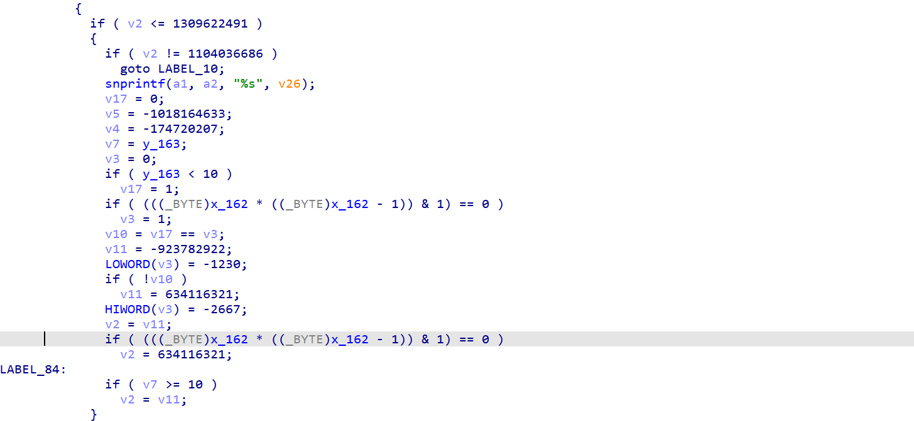

# 小红书风控
version: 7.54.0

用的是shumei的sdk  

## 混淆情况
java层   
函数名，字符串混淆  
字符串混淆，jeb自动解密，函数名没办法，硬着头皮看  

so层  
基本上 虚假控制流和平坦化都加了 但都是非常典型的ollvm 基本没魔改 所以可以用d810 或者 obpo(hluwa)的随便去除（当然也可以用angr符号执行来去除）
  
这是它的cfg图

## 破解情况
SMSDK这个类加载了smsdk这个so  
  
ida 打开smsdk 用d810 和 obpo对so 反混淆后
jnionload就是干了一件事，动态注册了这些smsdk类的函数  

