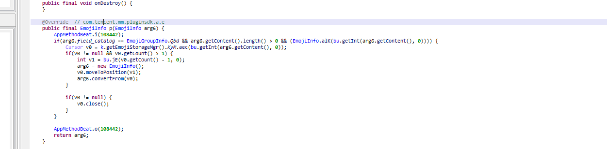

# wx分析日志


## 开启全局log

jadx搜索log,找到相关函数

看到setconsoleLogopen,基本可以判断出找到相关函数了，之后可以写edxposed插件或frida了


## 发送消息

先打开全局调试


ddms trace 一下，寻找onclick,因为我们在发消息时点的是按钮


继续点进去看看


hook 方法a 即可得到相关消息


## 修改消息内容

先查看一下控件id


adb shell dumpsys activity top 寻找控件id 定位MMChattingListView


去里面看看adapter 找到重写的getcount


可以判断出Ltf是里面的元素，frida hook一下判断ltf里是什么类

```javascript
Java.perform(function() {
 
    var clazz = Java.use('com.tencent.mm.ui.chatting.ChattingUIFragment');
    clazz.zt.implementation = function() {
        var adapter = Java.cast(this.Lrn.value,Java.use("com.tencent.mm.ui.chatting.a.a"))
        console.log("LtF",adapter.LtF.value);
        return clazz.zt.apply(this, arguments);
    }
});
```

是com.tencent.mm.storage.bz ,之后查看它的内容，hook一下就行

```javascript
Java.perform(function() {
    var clazz = Java.use('com.tencent.mm.ui.chatting.a.a');
    clazz.notifyDataSetChanged.implementation = function() {
        var data = this.LtF.value;
        var data_size = data.size();
        console.log("data_size",data_size);
        for(var i=0;i<data_size;++i){
            console.log("Message"+i,Java.cast(data.get(i),Java.use("com.tencent.mm.storage.bz")).field_content.value);
        }
        Java.cast(data.get(5),Java.use("com.tencent.mm.storage.bz")).field_content.value = Java.use("java.lang.String").$new("随便输入");
         return clazz.notifyDataSetChanged.apply(this, arguments);
    }
});
```

## 修改掷色子或猜拳

和发消息一个分析方法 ddms trace一下onclick，找到相关函数com.tencent.mm.emoji.panel.a.q$1.onClick


进入v0.a看看


frida hook一下查看一些主要参数

```javascript
 var clazz = Java.use("com.tencent.mm.emoji.panel.a.d");
    clazz.a.overload('android.view.View', 'android.content.Context', 'int', 'com.tencent.mm.emoji.a.b.ac').implementation = function(){
        //console.log("arg2A:",arguments[1]);
        var ar4_type= arguments[3].type
      //  var h1 = Java.cast(arguments[3].value,Java.use("com.tencent.mm.emoji.a.b.h"))
        //console.log(h1.ggJ);
        console.log("ar4_type",ar4_type.value); 

        //console.log()
        clazz.a.apply(this,arguments);
    }
```

type为0 ，继续看看看v1.getgroup,v1是arg[3].ggj,frida反射看看

```javascript
 var clazz1 = Java.use("com.tencent.mm.storage.emotion.EmojiInfo");
    clazz1.getGroup.implementation = function(){
    
        var ret_val = clazz1.getGroup.apply(this,arguments);
        console.log("get group:",ret_val);
        return ret_val;   
     }
或者
Java.perform(function(){
    var clazz = Java.use("com.tencent.mm.emoji.panel.a.d")
    clazz.a.overload('android.view.View', 'android.content.Context', 'int', 'com.tencent.mm.emoji.a.b.ac').implementation = function(){
        var clz = Java.cast(arguments[3],Java.use("com.tencent.mm.emoji.a.b.ac"));
        var fields = Java.cast(clz.getClass(),Java.use('java.lang.Class')).getDeclaredFields();
                    //console.log(fields);
                    console.log("arg3:" +clz)
                    for (var j = 0; j < fields.length; j++) {
                        var field = fields[j];
                        field.setAccessible(true);
                        var name = field.getName();
                        var value =field.get(clz)
                        console.log("\t\tname:"+name+"\tvalue:"+value)}
        
        
        this.a.apply(this,arguments)
    }
})
```

getgroup返回的是 return this.field_catalog;


是18 QBd也是18 ，继续看看p方法，有两个类，frida hook看看 哪个被调用 发现`com.tencent.mm.ca.a.p()`先被调用，之后继续看调用



 最终 发现JE方法是主要方法 色子是(5,0) 猜拳就(2,0) , 所以改个返回值就行了

中间过程用到的脚本

```javascript
Java.perform(function(){
    var clazz = Java.use("com.tencent.mm.emoji.panel.a.d");
    clazz.a.overload('android.view.View', 'android.content.Context', 'int', 'com.tencent.mm.emoji.a.b.ac').implementation = function(){
        //console.log("arg2A:",arguments[1]);
        var ar4_type= arguments[3].type
      //  var h1 = Java.cast(arguments[3].value,Java.use("com.tencent.mm.emoji.a.b.h"))
        //console.log(h1.ggJ);
        console.log("ar4_type",ar4_type.value); 

        //console.log()
        clazz.a.apply(this,arguments);
    }

    var clazz1 = Java.use("com.tencent.mm.storage.emotion.EmojiInfo");
    clazz1.getGroup.implementation = function(){
    
        var ret_val = clazz1.getGroup.apply(this,arguments);
        console.log("get group:",ret_val);
        return ret_val;   
     }

     var clazz2 = Java.use("com.tencent.mm.ca.a");
     clazz2.p.implementation = function(){
       console.log("com.tencent.mm.ca.a.p:",arguments[0]);
       var ret1 = clazz2.p.apply(this,arguments);
       console.log("com.tencent.mm.ca.a.p ret:",ret1);
       return ret1;
     }

     var clazz3 = Java.use("com.tencent.mm.plugin.emoji.e.f");
     clazz3.p.implementation = function(){
       console.log("com.tencent.mm.plugin.emoji.e.f.p:",arguments[0])
       var ret2 = clazz3.p.apply(this,arguments);
       console.log("com.tencent.mm.plugin.emoji.e.f.p ret:",ret2);
       return ret2;

     }

     var clazz4 = Java.use("com.tencent.mm.sdk.platformtools.bu")
     clazz4.jE.implementation = function(){
       console.log("JE angr[0]:",arguments[0]);
       var ret4 = clazz4.jE.apply(this,arguments);
       console.log("JE ret:",ret4);
       if(arguments[0] == 5)
       ret4 = 5
       else ret4 = 2
       return ret4;
       
     }
 
})
```

## 撤销记录

聊天记录是放在EnMicroMsg.db里的，所以你的撤销，填写聊天记入铁定用到了数据库函数hook一下updateWithOnConflict

```javascript
// wx的防撤销
function showStacks3(str_tag) 
{
   var Exception=  Java.use("java.lang.Exception");
   var ins = Exception.$new("Exception");
   var straces = ins.getStackTrace();

   if (undefined == straces || null  == straces) 
   {
       return;
   }

   console.log("=============================" + str_tag + " Stack strat=======================");
   console.log("");

   for (var i = 0; i < straces.length; i++)
   {
       var str = "   " + straces[i].toString();
       console.log(str);
   }

   console.log("");
   console.log("=============================" + str_tag + " Stack end=======================\r\n");
   Exception.$dispose();
};
function a(){
Java.perform(function(){


   
    var sql = Java.use('com.tencent.wcdb.database.SQLiteDatabase');
// int updateWithOnConflict(String str, ContentValues contentValues, String str2, String[] strArr, int i)
sql.updateWithOnConflict.implementation=function(a1,a2,a3,a4,a5)
{  
  console.log("hook update start");
  console.log("a1:"+a1);
  console.log("a2:"+a2);
  console.log("a3:"+a3);
  console.log("a4:"+a4);
  console.log("a5:"+a5);
  console.log("rtn:"+this.updateWithOnConflict(a1,a2,a3,a4,a5));
  console.log("this : "+this)
  //  var threadef = Java.use('java.lang.Thread');
  //  var threadinstance = threadef.$new();
  //  var stack = threadinstance.currentThread().getStackTrace();
  //  function Where(stack){
  //   for(var i = 0; i < stack.length; ++i){
  //     console.log(stack[i].toString());
  //   }
  // }
  //  console.log("Full call stack:" + Where(stack));
  showStacks3("updateWithOnConflict")
    return this.updateWithOnConflict(a1,a2,a3,a4,a5)
}
}


)
}
setTimeout(a,10)
```

发现当我撤销消息时，数据库动了三次


msgtype为10000是一个重要的点，试了几次发现只有撤销时type为10000，再看看栈回溯，对比正常信息发送 经过哪些函数，撤销时经过哪些函数

com.tencent.mm.model.f.a是个重点 ，发现


一眼就看到arg24为revokemsg 就是我们所走的流程 直接改一下就行

```javascript
var modlef = Java.use('com.tencent.mm.model.f');
modlef.a.overload('java.lang.String', 'java.util.Map', 'com.tencent.mm.aj.e$a').implementation=function(a1,a2,a3)
{   console.log("hook a start");
    console.log("a1:"+a1);
    console.log("a2:" + JSON.stringify(a2));
    console.log("a3:"+a3);
    if(a1=="revokemsg")return null
    return this.a(a1,a2,a3)
}
```

